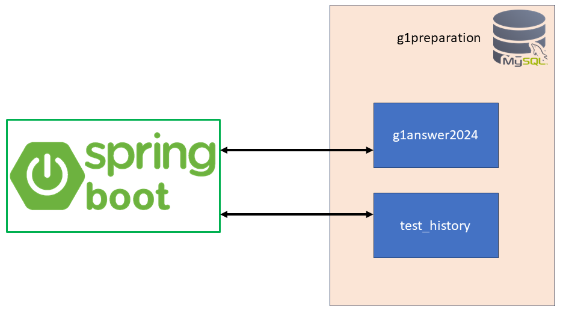

# Practice For Ontario G1 Test: Backend

This program is the backend component of the *Practice For Ontario G1 Test* project. It works with the [Practice For Ontario G1 Test: Frontend](https://github.com/joejeye/g1practice-frontend) developed by React.js.

## Overview

This program helps you keep track of your progress in preparation for Ontario G1 test. You need to buy the *Ontario Driver's Study Guide* (cover shown in the following figure) in order to access the test questions.


The web page looks like the following figure. You answer each question by choosing one of the four chioces A, B, C, D. After you click the submit button, the pass rate and the number of attempts for this quesiton are updated immediately. The history of attempts is stored in your local MySQL database and therefore persists through program restarts.


## MySQL

### Table Schemas

You need to create a MySQL database, named `g1preparation`, containing two tables: `g1answer2024` and `test_history`, as shown in the following figure.


The schema of the able `g1answer2024` is
```mysql
+----------+--------------+------+-----+---------+----------------+
| Field    | Type         | Null | Key | Default | Extra          |
+----------+--------------+------+-----+---------+----------------+
| id       | int          | NO   | PRI | NULL    | auto_increment |
| answer   | varchar(10)  | YES  |     | NULL    |                |
| question | text         | YES  |     | NULL    |                |
| img_path | varchar(500) | YES  |     | NULL    |                |
+----------+--------------+------+-----+---------+----------------+
```

The schema of the table `test_history` is
```mysql
+-------------+--------------+------+-----+-------------------+-------------------+
| Field       | Type         | Null | Key | Default           | Extra             |
+-------------+--------------+------+-----+-------------------+-------------------+
| id          | int unsigned | NO   | PRI | NULL              | auto_increment    |
| question_no | int unsigned | YES  |     | NULL              |                   |
| selection   | varchar(10)  | YES  |     | NULL              |                   |
| is_correct  | tinyint(1)   | YES  |     | NULL              |                   |
| submit_time | datetime     | NO   |     | CURRENT_TIMESTAMP | DEFAULT_GENERATED |
+-------------+--------------+------+-----+-------------------+-------------------+
```

You can import into the table `g1answer2024` the solution to the test questions from the file `src/main/resources/g1answer2024.sql`.

### Configure Connection

Create a file named `application.properties` in the directory `src/main/resources/` and pasted the following content into the file
```
spring.application.name=g1-practice-backend
spring.datasource.url=jdbc:mysql://localhost:3306/g1preparation
spring.datasource.username=root
spring.datasource.password=yourpassword
spring.datasource.driver-class-name=com.mysql.cj.jdbc.Driver
spring.jpa.database-platform=org.hibernate.dialect.MySQLDialect
```
and change the user name and pass word in the file accordingly.

## Run

Start the backend program by running the following command
```sh
mvnw spring-boot:run
```
and then proceed to running the frontend program, see [Practice For Ontario G1 Test: Frontend](https://github.com/joejeye/g1practice-frontend/tree/main).